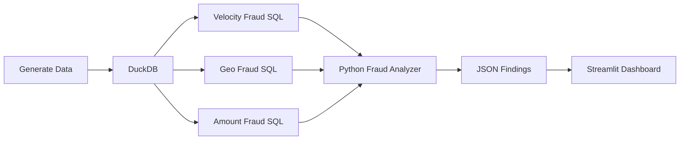

# 🚨 Fraud Pattern SQL Analysis

Production-style fraud detection pipeline built using SQL, DuckDB, Python and Streamlit.

This project simulates banking transactions and detects real-world fraud patterns using analytical SQL and Python orchestration.

---

## Problem Statement

Financial institutions process millions of transactions daily.

Fraud often appears as hidden patterns rather than obvious failures.

This project detects:

- Velocity Fraud  
- Geographic Impossibility Fraud  
- Amount Deviation Fraud  

using SQL, statistical methods and behavioral analysis.

---

## Fraud Types

### 1. Velocity Fraud

Too many transactions in a short period.

Example:

Card used:

10:00  
10:01  
10:02  
10:03  
10:04  
10:05

Flagged when transaction count exceeds threshold.

Uses:

- SQL Window Functions
- RANGE BETWEEN INTERVAL

---

### 2. Geographic Fraud

Card used in impossible locations.

Example:

Delhi → 9:00 AM

Mumbai → 9:30 AM

Uses:

- LAG()
- Timestamp calculations
- City travel reference table

---

### 3. Amount Deviation Fraud

Transaction amount significantly deviates from historical behavior.

Uses:

- AVG
- STDDEV
- Z-score anomaly detection

---

## Architecture



## Tech Stack

- Python
- DuckDB
- SQL
- Pandas
- Faker
- pytest
- Streamlit

---

## Folder Structure

```text
fraud-pattern-sql-analysis/

dashboard/
sql/
tests/
data/
results/

generate_data.py
fraud_analyzer.py
README.md
```

---

## Setup

```bash
git clone <repo>

cd fraud-pattern-sql-analysis

python -m venv venv

source venv/bin/activate

pip install -r requirements.txt
```

---

## Run Pipeline

```bash
python fraud_analyzer.py
```

---

## Run Dashboard

```bash
streamlit run dashboard/app.py
```

---

## Run Tests

```bash
pytest
```

---

## Sample Output

```json
{
   "summary":{
      "velocity_flags":1800,
      "geo_flags":400,
      "amount_flags":900
   }
}
```

---

## Key Learnings

- Window functions
- LAG()
- Statistical anomaly detection
- DuckDB analytics
- Data pipeline orchestration
- Test-driven engineering
